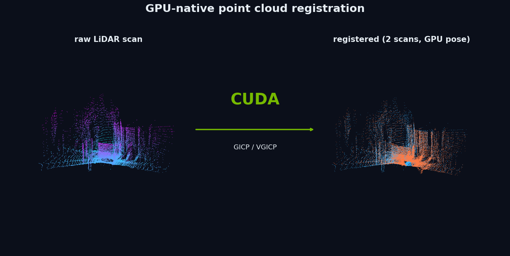
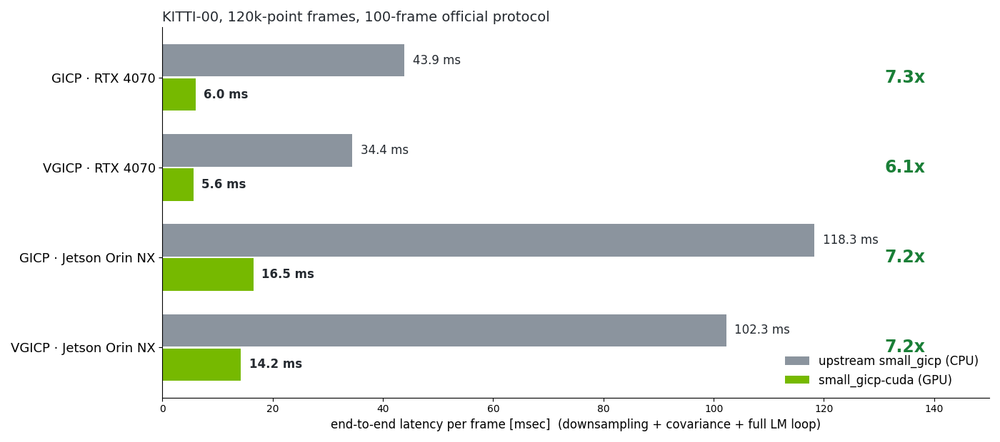
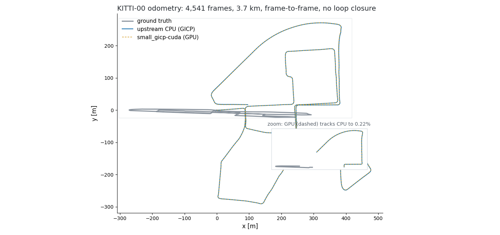
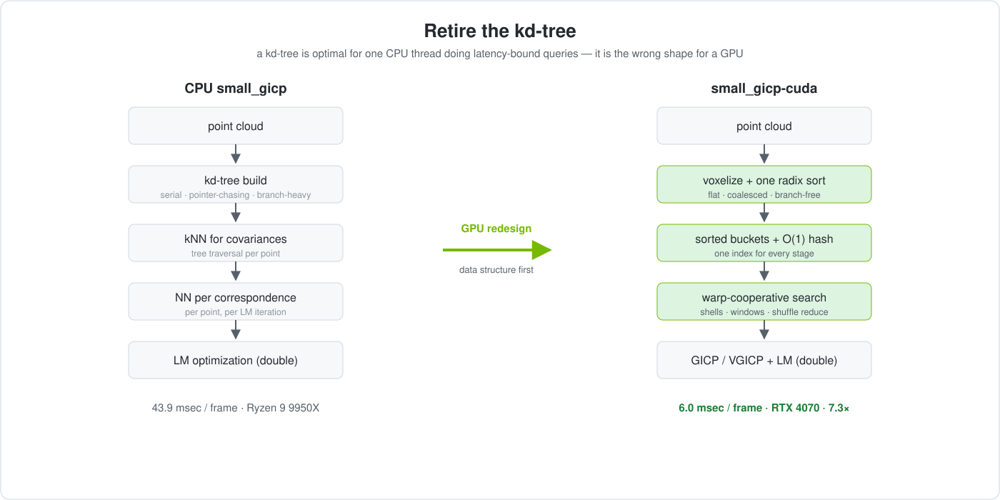
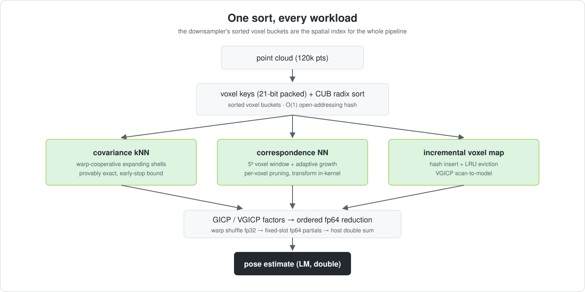

# small_gicp-cuda

**GPU-accelerated GICP / VGICP for real-time LiDAR registration.**

[](https://developer.nvidia.com/cuda-toolkit)
[](https://isocpp.org/)
[](BENCHMARK_GPU.md)
[](LICENSE)
[中文说明](README_zh.md)

<p align="center">
  
</p>

A CUDA-native rewrite of [small_gicp](https://github.com/koide3/small_gicp): the full
registration pipeline — downsampling, exact covariance kNN, correspondence search, LM
iterations — rebuilt around GPU spatial primitives instead of CPU kd-trees, with the
upstream optimization objective and accuracy preserved.

**7.5× faster** · **162 FPS** · **≤0.22% trajectory deviation** · **358 MiB GPU memory** · **Jetson Orin support**

Runs on any CUDA 12 NVIDIA GPU, desktop dGPU or Jetson module. No kd-trees. No CPU fallback.
No accuracy trade-off.

## Performance

<p align="center">
  
</p>

Timing is **end-to-end per frame**: H2D upload, downsampling, covariance estimation,
correspondence search, and the full LM loop to convergence — nothing excluded. Over the
full 4541-frame sequence the same picture holds: GICP 45.2 → **6.0 ms** (7.5×, 162 fps),
VGICP 35.5 → **5.7 ms** (6.2×, 170 fps). Against NVIDIA cuPCL (cuICP) at matched inputs:
**1.5–1.65× faster**, while also providing the distribution-to-distribution GICP/VGICP
objectives cuPCL doesn't have ([protocol](BENCHMARK_GPU.md)).

## End-to-End Odometry

<p align="center">
  
</p>

This is not a microbenchmark. The complete KITTI-00 sequence, chained frame-to-frame with no
loop closure:

| | |
|---|---|
| sequence | KITTI-00, official S3 data + GT — **4,541 frames**, 3.7 km |
| GICP trajectory vs upstream CPU | **0.22%** deviation over the whole run |
| VGICP trajectory vs upstream CPU | **1.45%** deviation over the whole run |
| determinism | 5 reruns → byte-identical trajectory files |
| cross-architecture | Orin (sm_87) ≡ desktop (sm_89), APE = 0.0000 m |
| sustained resources | 358 MiB GPU memory (LRU-bounded), 86% mean utilization |

Both implementations drift identically against ground truth (RPE(400) 2.908 vs 2.907
deg/km) — chained pairwise registration without loop closure behaves this way; the GPU
reproduction tracks the original, it doesn't improve or degrade it.

## Why GPU?

<p align="center">
  
</p>

A kd-tree is close to optimal for a single CPU thread doing latency-bound queries. It is the
wrong shape for a GPU: thousands of threads want coalesced, branch-free access to a flat
structure — not divergent pointer chasing down a tree. So this is not "CUDA-translate the
CPU code"; the spatial indexing, memory layout, neighbor search, and reduction strategy are
redesigned so the pipeline fits the GPU's execution model at the data-structure level.

## The key idea

<p align="center">
  
</p>

**One sort, every workload.** The downsampler's sorted voxel buckets are not a byproduct —
they *are* the spatial index that covariance estimation, correspondence search, and the
VGICP voxel map all read through O(1) hash probes.

## Accuracy: no shortcut

Speed was not bought with approximation:

- **Same objective** — GICP distribution-to-distribution factors, VGICP voxel-map factors, upstream math unchanged
- **Exact covariance kNN** — provable early-stop bound on expanding shells; approximate neighborhoods were tried and rejected (50× drift amplification on real sequences)
- **Same optimizer** — LM constants (λ₀=1e-3, ×10, 1e-3 m / 0.1°) ported line-by-line; 6×6 solve in double on the host
- **20 kernel-parity tests** build both implementations and assert agreement stage by stage: downsampling, covariances, NN, H/b/e, voxel map, end-to-end
- **Measured**: ≤0.01% APE/RPE vs upstream on 100 frames; 0.22% / 1.45% over 4541 frames

## small_gicp vs small_gicp-cuda

| | small_gicp | small_gicp-cuda |
|---|---|---|
| Execution | CPU (OpenMP/TBB optional) | NVIDIA GPU (CUDA 12), dGPU or Jetson |
| Spatial index | kd-tree per cloud, rebuilt per frame | sorted voxel buckets + O(1) hash, built by downsampling |
| Neighbor search | per-point tree traversal | warp-cooperative GPU search, provably exact |
| Precision | double throughout | fp32 storage/factor math + fp64 reductions + double solve |
| Determinism | thread-scheduling dependent | same input → same output bytes, across runs and architectures |
| Engines | ICP / Plane-ICP / GICP / VGICP | GICP + VGICP |
| Extras | PCL adapter, ROS bridge, Python bindings | none yet — upstream CPU code stays in-tree as the parity baseline |
| Target hardware | any CPU | NVIDIA GPU / Jetson Orin |

The upstream CPU implementation is kept unmodified in-tree (`include/small_gicp`, `src/`)
because the parity suite needs it: this repo's accuracy claim is "identical to upstream",
tested kernel by kernel. `master` tracks the upstream baseline.

## Under the hood

- **`sgc::GpuCloud`** — points as `float4` centroids, covariances as 9 packed floats, both in voxel-key order after downsampling: every later kernel reads coalesced, spatially coherent memory.
- **Voxelization** — fast-floor + 3×21-bit key packing into one `uint64`; CUB `DeviceRadixSort` orders points, an exclusive scan gives bucket boundaries. No separate index build exists.
- **Voxel hashing** — power-of-two open addressing keyed by splitmix64; one `ulonglong2` slot (key + value in a single 16 B load), `~0ull` empty marker. Pure arithmetic probes, no divergence.
- **Covariance kNN** — one warp per point; lanes stride shell voxels, candidates merge through `__shfl_down_sync` tournaments, the shell loop stops when a distance bound proves no unexplored voxel can improve the kNN set; sparse regions fall back to warp-level brute force. Upstream's eigendecomposition + eigenvalue-replacement model (plane-like (1e-3, 1, 1)).
- **Correspondence search** — per LM iteration, a batch NN kernel probes a 5³ voxel window per transformed source point, then expands with per-voxel pruning until the nearest is provable. The current transform is applied inside the kernel.
- **Reductions & determinism** — per-point H/b/e accumulate in fp32 via warp shuffles; lane 0 writes fp64 partials to a fixed slot per launched warp; the host sums in order, in double. Fixed launch configurations → the same output bytes every run, on every architecture.

## Who is this for?

LiDAR SLAM / LIO pipelines that need registration under 10 ms · autonomous driving and
robotics perception on Jetson-class hardware · 3D reconstruction bottlenecked on CPU
neighbor search · CUDA engineers looking for a data-structure redesign case study.

> Don't accelerate the tree. Remove the tree.

## Quick start

```bash
git clone https://github.com/Functionhx/small_gicp.git && cd small_gicp
cmake -B build -DBUILD_CUDA=ON -DCMAKE_BUILD_TYPE=Release   # add -DCMAKE_CUDA_ARCHITECTURES=87 for Jetson Orin
cmake --build build -j$(nproc)
ctest --test-dir build          # 20 kernel-parity tests (requires a GPU)
./build/cuda/odometry_gpu <velodyne_dir> --exec full-gpu --engine gicp
```

Requires: CUDA 12.x toolkit, Eigen3, CMake ≥ 3.18.

## Usage

```cpp
#include <sgc/points/gpu_cloud.hpp>
#include <sgc/voxel/downsample.hpp>
#include <sgc/preproc/covariance.hpp>
#include <sgc/reg/gicp.hpp>

sgc::GpuCloud target = sgc::GpuCloud::from_host(target_points);   // std::vector<Eigen::Vector4f>
sgc::Downsampler downsampler;
downsampler.run(target, target_points.size(), 0.25);              // voxel buckets + hash index
sgc::estimate_covariances(target, 0.25f, 20);                     // exact kNN-20 covariance

sgc::GicpGpu reg;                                                 // LM constants = upstream
auto result = reg.align(target, source, init_T, 0.25f);
```

VGICP scan-to-model: `sgc::VoxelHashMap` (incremental Gaussian voxel map with LRU) +
`sgc::VgicpGpu::align(...)`. Benchmark harness with runtime-switchable policies:
`cuda/bench/odometry_gpu`
(`--exec full-gpu|hybrid|cpu --engine gicp|vgicp --nn voxel3|voxel5|exact-bf`).

## Jetson

Built and validated on-device on Jetson Orin NX (JetPack 6, CUDA 12.2, sm_87): 20/20 parity
tests pass, GICP 118.3 → **16.5 ms**, VGICP 102.3 → **14.2 ms**, trajectories bit-agree with
the desktop GPU. Deployment guide: [JETSON.md](JETSON.md) (cuda-jetson branch).

## Documentation

[BENCHMARK_GPU.md](BENCHMARK_GPU.md) results, methodology, ablations, cuPCL comparison,
reproduction commands (figures on this page: `scripts/make_readme_figures.py`) ·
[WORKLOG.md](WORKLOG.md) engineering log incl. failed approaches ·
[docs/superpowers/specs](docs/superpowers/specs/) design doc ·
[README_upstream.md](README_upstream.md) original CPU library README.

## Credits & license

Derivative of [koide3/small_gicp](https://github.com/koide3/small_gicp) by Kenji Koide
(AIST), MIT license inherited. If you use this work, please cite the upstream JOSS paper for
the algorithms and this repository for the CUDA implementation.
